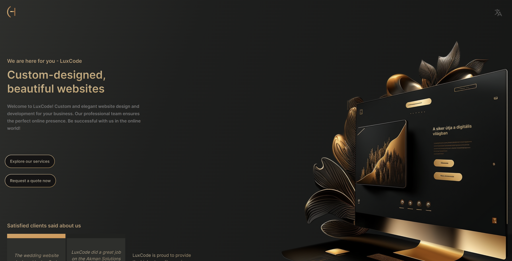

# LuxCode

This is a web-based application built using React.js, offering a sleek user interface and responsive design. Crafted with best practices in mind, it provides a robust starting point for any web development project or prototype.

## Live Demo

The live version of the project is hosted on Netlify and can be accessed at [https://luxcode.dev/](https://luxcode.dev/).

## Getting Started

These instructions will get you a copy of the project up and running on your local machine for development and testing purposes.

### Prerequisites

- [Node.js](https://nodejs.org/) and npm (Node Package Manager) - [Installation guide](https://docs.npmjs.com/downloading-and-installing-node-js-and-npm)

### Forking the Repository

To contribute to this project:

1. Fork the repository by clicking the "Fork" button at the top right corner of this page.
2. Clone your forked repository onto your local machine:
3. Navigate to the project directory:

### Installing Dependencies

1. Install the required dependencies:

### Running the App

After installing the dependencies, you can run the app in development mode:

This will start the development server, and the app should open in your default web browser. If not, you can manually navigate to `http://localhost:3000/` to view the app.

## Contributing

Pull requests are welcome. For major changes, please open an issue first to discuss what you would like to change.

## License

MIT
